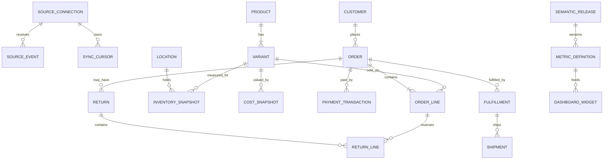
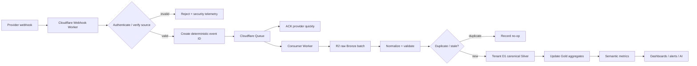
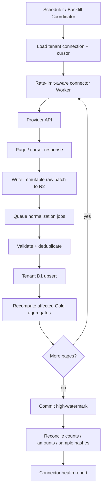

# Lumi BI: Commerce Intelligence Platform Strategy

## Executive summary

**Recommendation:** Lumi BI should not be built as “a dashboard product with connectors.” It should be built as a **governed commerce intelligence layer** in which connectors continuously turn heterogeneous operational data from Nhanh.vn, Haravan, Shopee and future commerce systems into one canonical business model, one semantic metrics layer, and then dashboards and AI consume only that governed layer.

The architecture I recommend is:

```text
Nhanh.vn ─────┐
Haravan ──────┤
Shopee ───────┤
Shopify ──────┤
TikTok Shop ──┤
Lazada ───────┘
       │
       ▼
Provider-specific connectors
       │
       ├── Webhooks / push
       ├── Incremental polling
       └── Bulk/backfill
       │
       ▼
Immutable raw events/snapshots
Cloudflare R2                    ← Bronze
       │
       ▼
Validation + dedupe + normalization
       │
       ▼
Tenant-specific D1              ← Silver / hot canonical
       │
       ├── Orders
       ├── Lines
       ├── Products / variants
       ├── Customers
       ├── Inventory
       ├── Payments
       ├── Fulfillments
       ├── Returns
       └── Cost snapshots
       │
       ▼
Versioned semantic metrics      ← Gold
       │
       ├── Revenue
       ├── Gross margin
       ├── AOV
       ├── Return rate
       ├── Fulfillment time
       └── Conversion*
       │
       ▼
Dashboards / alerts / AI analyst
```

The asterisk matters: **conversion cannot be inferred from orders alone**. It requires traffic/session data. Likewise, gross margin cannot be trusted merely because a product has a current cost field: Lumi needs **cost-at-sale or effective-dated cost history**. Those two distinctions are exactly the kind of semantic rigor that separates a trusted BI system from an attractive but misleading dashboard.

Databricks provides the right conceptual model: retain raw data faithfully, validate and deduplicate into a conformed layer, then publish business-ready semantic data separately. Databricks explicitly recommends Bronze → Silver → Gold, with raw historical data retained for audit/reprocessing, validation and deduplication in Silver, and dimensional/aggregated business models in Gold. citeturn22view2 Its newer Unity Catalog metric views go further: business measures are defined once and independently of the dimensions used to group/filter them, so dashboards, SQL and AI agents share the same definitions. citeturn22view0

**The strongest strategic conclusion is therefore:**

> **The connector is not the product. The canonical commerce graph + semantic metric catalog + lineage + reusable dashboard/AI packs are the compounding asset.**

For release speed, I would implement the providers in this order:

| Priority | Work | Why |
|---|---|---|
| **P0** | Canonical connector SDK + R2/D1 substrate + **Nhanh.vn** complete read path + **Haravan orders/products baseline** + Shopee access spike | Nhanh has unusually usable official docs, incremental filters and webhooks; Haravan has strong Commerce resources and event API; Shopee access uncertainty must be retired immediately. |
| **P1** | Haravan complete + **Shopee direct connector** + profitability/inventory packs + reconciliation engine | Gives Lumi meaningful omnichannel coverage for Vietnamese merchants. |
| **P2** | TikTok Shop, Lazada, Shopify/reference connector, traffic/ads, settlement data, large-scale object-store analytics | Expand only after common abstractions survive the first three providers. |

Nhanh's V3 API is particularly attractive for P0. It exposes access-token-scoped APIs, supports incremental product/inventory retrieval, defaults to 150 requests per 30 seconds, offers webhooks for order/product/inventory changes, and explicitly recommends storing data locally rather than repeatedly scanning everything. citeturn24view0turn24view1turn24view2turn24view3turn26view0

Haravan is similarly suitable: Commerce APIs are scope-controlled, long-lived tokens are available through its install flow, the default rate-limit bucket is 80 requests with `Retry-After` on throttling, orders have explicit incremental filters, and the Events resource supports `since_id` incremental consumption. citeturn26view4turn26view5turn26view2turn26view6turn26view7

Shopee should remain strategically important, but there is a documentation-risk issue: the official Open Platform API reference and indexed pages for endpoints such as `v2.order.get_order_list` and `v2.product.get_item_list` are visible, but their bodies were not retrievable from this research environment. I therefore would **not hard-code Shopee auth, quota or pagination assumptions from memory or unofficial wrappers**. Acquire partner access and freeze official fixtures before implementation. citeturn8search24turn8search17turn8search6

Cloudflare is economically appropriate for the first phase, provided D1 is treated as a **hot serving store rather than an unlimited analytical warehouse**. Paid D1 supports 50,000 databases per account and 10 GB per database, but each individual database is inherently single-threaded and processes queries one at a time. Cloudflare explicitly positions D1 for horizontal scaling across many smaller per-user/per-tenant/per-entity databases. citeturn19view0

The target system should therefore look less like traditional “BI SaaS” and more like:

> **Databricks semantics and governance, compressed into an opinionated Cloudflare-native commerce data platform for SMEs.**

My confidence in the architecture is **high**. Confidence in provider-specific Shopee details is **low until partner documentation/test credentials are available**, and those unknowns are explicitly isolated below rather than filled with guesses.

## Connector landscape and source-system contracts

The right level of abstraction is not “every API looks the same.” They do not. The right abstraction is:

```text
Common connector lifecycle
+
provider-specific source semantics
+
canonical downstream contract
```

Every connector should implement something close to:

```ts
interface CommerceConnector {
  discoverCapabilities(): Promise<ConnectorCapabilities>;
  validateCredentials(): Promise<ConnectionIdentity>;

  initialBackfill(request: BackfillRequest): AsyncIterable<RawEnvelope>;
  incrementalSync(cursor: SyncCursor): AsyncIterable<RawEnvelope>;
  handleWebhook(request: Request): Promise<VerifiedSourceEvent>;

  fetchObject(ref: SourceObjectRef): Promise<RawEnvelope>;
  reconcile(window: TimeWindow): Promise<ReconciliationReport>;

  normalize(raw: RawEnvelope): Promise<CanonicalMutation[]>;
}
```

That contract should remain stable while Nhanh, Haravan and Shopee adapters contain the source-specific ugliness.

### Official API inventory

The table below is intentionally a **minimum BI surface**, not a claim to enumerate every endpoint offered by each vendor.

| Provider | Orders | Products / inventory | Customers | Payment / shipping / returns | Incremental/event path |
|---|---|---|---|---|---|
| **Nhanh.vn V3** | `/v3.0/order/list` is the order-list resource referenced by Nhanh webhook docs; `orderAdd`, `orderUpdate`, `orderDelete` deliver order changes. | `POST /v3.0/product/list`; `POST /v3.0/product/inventory`. Product pages max at 100 records; inventory has depot-level remain/available/holding/shipping/damaged data. | `/v3.0/customer/list`; customer records include IDs, identity/contact/business/group fields and historical amount fields. | Shipping/order state is exposed through order data/webhooks. A complete standalone payment/settlement/return endpoint surface was **not verified** in this review and should remain `unspecified` until sandbox inspection. | Product/inventory support `updatedAtFrom/To`; webhook events cover products, inventory and orders. citeturn24view1turn24view2turn24view3turn5search6turn5search7 |
| **Haravan Commerce** | `GET /com/orders.json`, count and single-order endpoints; order data includes fulfillment/financial/refund-related state. | `/com/products.json`; Commerce scopes include Inventory Adjustment, Inventory Transfer, Purchase Order, Purchase Receive and Inventory Location resources. | Commerce scope exposes Customer and Customer Address APIs. | Order scope includes transaction data; separate shipping scope exposes Shipping Rates. Refunds occur within the order model. Exact settlement-accounting coverage should be tested with a real merchant. | `/com/events.json`, `since_id`, time filters; webhook use requires `wh_api`. citeturn26view5turn26view6turn26view7 |
| **Shopee Open Platform V2** | Official indexed endpoint: `v2.order.get_order_list`. | Official indexed endpoints include `v2.product.get_item_list` and `v2.product.get_item_base_info`. | Buyer/customer representation and privacy rules require partner-doc verification. | Logistics, payment/escrow and returns modules need authenticated documentation review before freezing Lumi's contract. | Official docs expose a Push API family, but exact subscriptions, auth verification, retries and quotas are **unverified here**. citeturn8search17turn8search6turn8search27turn11search3 |
| **Shopify GraphQL Admin — reference connector** | `orders` GraphQL connection. | `products` and related inventory resources. | Customer resources in Admin GraphQL. | Fulfillment/payment/refund resources exist under the Admin API. | Rich webhooks plus asynchronous Bulk Operations; bulk output is JSONL. citeturn25view0turn25view2turn25view3turn25view4 |

Nhanh API requests use `appId` and `businessId`, with the access token carried in the `Authorization` header. Product/inventory APIs use Nhanh's `paginator.next` contract instead of conventional page numbers. Nhanh explicitly says to reuse the returned `next` value and supports temporal incremental filters. Its access tokens are documented as having one-year validity, which means Lumi needs credential-expiry monitoring rather than discovering expiry during a failed nightly sync. citeturn24view1turn24view2turn24view3

Nhanh's default limit is **150 calls / 30 seconds**, although an individual API can specify a different quota. This strongly favors webhook-first ingestion plus periodic reconciliation instead of high-frequency full scans. citeturn26view0

Its inventory model is particularly useful for BI: a product can expose retail, wholesale, import and average cost plus total and depot-level inventory states including remaining, shipping, damaged, holding, transferring and available quantities. However, Nhanh warns that results can be restricted by the depots granted to the token. Lumi must therefore store the **authorization coverage** of the connection alongside its data freshness; “inventory = 8” is dangerous if the token only sees one of four warehouses. citeturn24view2

Nhanh webhooks require HTTPS, POST and HTTP 200; the configured verify token is transmitted through `Authorization`. Events include product add/update/delete, inventory changes and order add/update/delete. Failed deliveries can be retried up to three times; Nhanh recommends persisting quickly and processing later, and warns that bad webhook reliability can lead to disabling the webhook or even locking the app. Historical events predating installation/webhook enablement are not replayed. citeturn24view3

For Haravan, Commerce APIs use granular read/write scopes such as `com.read_products`, `com.read_customers`, `com.read_inventories` and `com.read_orders`. Read scopes are GET-only; write scopes include read plus mutating methods. The `grant_service` installation scope enables a long-lived access token, and webhook access requires `wh_api`. For Lumi BI, **request read-only scopes by default**; a BI connector has no business changing a customer's orders because it happens to possess a broad token. citeturn26view4turn26view5

Haravan's rate limiter exposes `X-Haravan-Api-Call-Limit`, with a documented bucket of 80, and returns `429` plus `Retry-After` when throttled. Rather than hardcoding a sustained calls-per-second number, Lumi should dynamically pace from these headers. citeturn26view2

Haravan orders can be retrieved by `since_id`, fields, status and other filters; its Events API likewise supports `since_id`, `created_at_min/max`, filtering and event verbs. That makes the event stream a useful reconciliation/incremental mechanism even when webhooks are unavailable or suspect. citeturn26view6turn26view7

**SDK/export status from official material reviewed:**

| Provider | API representation | Bulk/export path | Official SDK status found in this research |
|---|---|---|---|
| Nhanh | JSON REST-like API | No API bulk-export facility identified; official Postman collection/examples exist. | **No first-party language SDK identified.** Use generated HTTP client/types rather than adopting an unverified wrapper. citeturn24view1 |
| Haravan | JSON Commerce API | No general bulk-export API identified in docs reviewed. | **No first-party SDK selected.** Plain typed HTTP adapter is sufficient for P0. citeturn26view5turn26view6 |
| Shopee | Open Platform V2 | **Unspecified pending partner-doc access.** | **Unspecified.** Do not adopt community SDK as the protocol authority. citeturn8search24 |
| Shopify | GraphQL/JSON | Native asynchronous Bulk Operations; output downloadable as **JSONL**; in API versions 2026-01+, up to five bulk query operations per app/shop can run simultaneously. | Official tooling exists, but Lumi can still keep its core HTTP/GraphQL adapter provider-neutral. citeturn25view0 |

Shopify is valuable here even if it is not the immediate Vietnamese GTM priority: its Bulk Operations implementation shows a good target contract. Large backfills run asynchronously, completion can be signaled by webhook instead of constant polling, and results can be downloaded as JSONL. Shopify also explicitly notes that webhook delivery is not guaranteed and recommends a fallback status check—a useful reminder that **webhooks reduce latency; they do not eliminate reconciliation**. citeturn25view0

## Canonical commerce model and semantic layer

The canonical layer should preserve both **source truth** and **business truth**.

Do not flatten provider payloads directly into one giant `orders` table and throw away what did not fit. Instead:

```text
Provider payload
     │
     ├── immutable RawEnvelope
     │
     └── canonical entities
             │
             └── governed semantic metrics
```

This maps directly onto the strongest Databricks lesson. Bronze retains source fidelity and history; Silver performs validation, type normalization, deduplication, late-data handling and schema evolution; Gold expresses semantically meaningful business datasets and measures. Databricks specifically recommends against writing ingestion directly into Silver because corrupt records or schema drift can otherwise contaminate the conformed data layer. citeturn22view2

For Lumi:

```text
R2 Bronze
raw immutable provider envelopes
        ↓
D1 Silver
canonical hot operational facts/dimensions
        ↓
D1 Gold
materialized dashboard aggregates
        ↓
Semantic Catalog
versioned metrics/dimensions/lineage
```

### Canonical schema proposal



The canonical entities should include source metadata on every meaningful record:

```text
tenant_id
source_provider
source_connection_id
source_object_type
source_object_id
source_created_at
source_updated_at
observed_at
raw_snapshot_ref
normalizer_version
canonical_version
```

That is the Lumi equivalent of lineage. Databricks Unity Catalog treats tables, views, models and other objects as governed securable assets, applying access control, lineage and auditing across them. Lumi does not need to clone Unity Catalog, but it should copy the principle: **source, metric, dashboard and AI tool are cataloged objects, not loose code conventions.** citeturn22view1

### Provider-to-canonical mapping

Exact source fields must be fixture-tested before code is considered production-ready; this table shows the contract Lumi should normalize toward.

| Canonical field/entity | Nhanh.vn | Haravan | Shopee | Shopify/reference |
|---|---|---|---|---|
| `product.source_id` | `product.id` | product `id` | item ID from Product API — exact field verification pending | Product GraphQL `id` |
| `product.name` | `name` | product title/name | item name — verify fixture | Product `title` |
| `variant.sku` | `code`; barcode separately | variant SKU | model/item SKU — verify exact source hierarchy | ProductVariant `sku` |
| `variant.unit_price` | `prices.retail` | variant/order-line price | item/model price — verify | price/price set |
| `cost_snapshot.unit_cost` | `prices.avgCost` or approved cost basis | **requires confirmed Haravan cost source or external ERP mapping** | **not assumed available** | inventory/item cost where authorized |
| `location.source_id` | depot `id` | inventory location ID | warehouse/location concept — verify | Location ID |
| `inventory.on_hand_qty` | depot/aggregate `remain` | inventory resource | stock field — exact API verification pending | inventory quantity |
| `inventory.available_qty` | `available` | derived/source inventory availability | verify | inventory availability |
| `customer.source_id` | customer `id` | customer `id` | buyer identity is privacy/scope-dependent; do not assume stable PII | Customer `id` |
| `order.source_id` | Nhanh order ID | order `id` | order SN/ID — exact contract pending | Order `id` |
| `order.order_number` | provider order identifier | order `name` / number | Shopee order identifier | Order `name` |
| `order.created_at` | source timestamp | `created_at` | verify | `createdAt` |
| `order.source_updated_at` | source update timestamp | `updated_at` where supplied | verify | `updatedAt` |
| `order.financial_status` | normalized from Nhanh status/payment fields | `financial_status` | normalize Shopee order/payment state | display/payment status |
| `order.fulfillment_status` | normalized from order/shipping state | `fulfillment_status` | normalize Shopee logistics/order state | fulfillment state |
| `order_line.quantity` | order product quantity | line item quantity | item/model quantity | LineItem quantity |
| `payment_transaction` | **exact payment endpoint/fields to verify** | order transaction data | Payment/Escrow module — authenticated docs required | transaction/payment resources |
| `shipment` | order shipping data/events | fulfillment/shipping resources | Logistics module — authenticated docs required | fulfillment/shipping resources |
| `return` / `return_line` | order/return behavior **requires fixture verification** | refunds/order state can seed canonical returns | Returns module — exact contract pending | returns/refunds resources |
| `raw_snapshot_ref` | Lumi-generated R2 key | Lumi-generated R2 key | Lumi-generated R2 key | Lumi-generated R2 key |

Nhanh product/inventory documentation directly exposes `avgCost`, but that is **not automatically historical COGS**. It is a present inventory/product valuation field. For reliable gross-margin reporting, Lumi should capture cost snapshots with `effective_from`/`observed_at` and define the merchant's chosen cost policy. citeturn24view1turn24view2

### Metric semantics

Do **not** have a single vaguely named `revenue` metric. Define economic concepts independently:

| Metric | Canonical definition | Critical caveat |
|---|---|---|
| `gross_sales` | Sum of line extended selling price before discounts/returns under an explicit status policy | Tax and shipping inclusion must be explicit. |
| `discount_amount` | Merchant + channel discounts allocated consistently to orders/lines | Marketplace-funded vs merchant-funded discount may need separation. |
| `returned_sales` | Amount reversed by accepted/completed returns | Cancellation is not necessarily a return. |
| `net_sales` | `gross_sales - merchant_discount - returned_sales` under an explicit business definition | Do not silently equate this with accounting revenue. |
| `collected_amount` | Successful payment collections less refunds where applicable | Settlement timing differs from order timing. |
| `cogs` | Quantity sold × effective unit cost, reversed consistently for accepted returns | Needs cost history; current product cost is insufficient. |
| `gross_margin_amount` | `net_sales - cogs` | Marketplace/payment/fulfillment fees may need a separate `contribution_margin`. |
| `gross_margin_pct` | `gross_margin_amount / net_sales` | NULL when denominator is zero. |
| `AOV` | Governed net-sales numerator / distinct included orders | Order inclusion statuses must be explicit. |
| `return_unit_rate` | returned units / fulfilled units | Keep separate from monetary return rate. |
| `return_value_rate` | returned sales value / fulfilled sales value | Specify return window. |
| `fulfillment_time` | `fulfilled_at - order_confirmed_at` or another named lifecycle pair | Never change the start/end event without versioning the metric. |
| `conversion_rate` | eligible completed orders / eligible sessions | **Impossible from orders alone. Requires storefront/session/traffic source.** |

Databricks metric views reinforce precisely this design: measures are centrally defined once and can then be grouped by authorized dimensions at query time; the same definitions can feed SQL, dashboards, alerts and AI agents. Databricks also supports agent metadata such as synonyms and display names on governed metric views to improve AI understanding. citeturn22view0

Lumi should adopt a lightweight equivalent:

```yaml
metric:
  id: net_sales
  version: 3
  measure:
    expression: gross_sales - merchant_discounts - returned_sales

  allowed_dimensions:
    - date
    - channel
    - store
    - product
    - category

  semantics:
    currency: tenant_reporting_currency
    timezone: tenant_timezone
    null_policy: explicit
    description: "Net merchandise sales under Lumi commerce policy v3"

  lineage:
    depends_on:
      - order_line
      - discount_allocation
      - return_line

  ai:
    synonyms:
      - net revenue
      - net merchandise sales
```

A tenant can override the policy, but not mutate the meaning invisibly:

```text
ecommerce-core/net_sales@3
             +
tenant-acme/net-sales-policy@2
             =
immutable semantic release
```

That release ID must appear in dashboards, AI answers and audit evidence.

## Ingestion and Cloudflare architecture

The central ingestion rule should be:

> **Webhook for latency, incremental polling for completeness, periodic reconciliation for truth, bulk backfill for history.**

No single mechanism is sufficient.

Databricks makes the same cost/latency distinction: continuous incremental ingestion offers lower latency at higher cost, triggered incremental ingestion trades some latency for cost, and batch ingestion is cheapest but highest latency. citeturn22view2

### Webhook path



Nhanh specifically recommends persisting webhook data and responding quickly rather than doing heavy processing synchronously; it can retry failed deliveries up to three times. citeturn24view3

Cloudflare Queues provides **at-least-once delivery**, so duplicates are possible. Cloudflare explicitly recommends assigning a unique ID/idempotency key when duplicates could create unintended behavior. Lumi must therefore design every consumer as idempotent, not merely hope duplicate delivery is rare. citeturn20view2

A normalized raw envelope should look approximately like:

```json
{
  "tenant_id": "tn_123",
  "connection_id": "con_nhanh_01",
  "provider": "nhanh",
  "object_type": "order",
  "source_object_id": "987654",
  "source_event_id": "provider-id-or-derived-hash",
  "event_type": "order_update",
  "observed_at": "2026-09-20T08:34:12Z",
  "source_updated_at": "2026-09-20T08:34:01Z",
  "cursor": "...",
  "payload_sha256": "...",
  "schema_version": "nhanh-v3/raw/1",
  "payload_ref": "r2://..."
}
```

Idempotency should be enforced at several levels:

```text
webhook receipt ID
       +
payload hash
       +
provider object ID
       +
source updated_at / sequence
       +
canonical mutation key
```

Do not assume timestamps alone impose a total ordering; keep the raw event even if canonical normalization concludes that it is stale.

### Polling and backfill path



The **cursor should advance only after the raw payload has been durably captured**, not merely after the upstream API returned HTTP 200. That gives Lumi a replayable recovery path.

For Nhanh, incremental product/inventory retrieval can use `updatedAtFrom/updatedAtTo`, with pages capped at 100 records; Nhanh warns that product update time does not capture inventory changes, so inventory requires its dedicated API/webhooks. citeturn24view1turn24view2

For Haravan, `since_id` on orders/events is useful for forward scans and the event stream can be used as a secondary detector of missed changes. citeturn26view6turn26view7

For Shopify, Lumi's future connector should prefer Bulk Operations for large history rather than paginating millions of objects. Shopify explicitly designed bulk operations to avoid client-side pagination/throttling complexity and returns results as JSONL. citeturn25view0

### Cloudflare responsibilities

| Service | Recommended role | Do not use it for |
|---|---|---|
| **Workers** | API/web UI backend, webhook verification, connector calls, normalization orchestration, semantic-query compiler | Long CPU-heavy warehouse scans |
| **Queues** | Decouple webhook ACK from processing, retries, normalization jobs, incremental batches | Exactly-once semantics |
| **R2** | Immutable raw Bronze, source snapshots, replay artifacts, large exports, tenant-pack releases | Fine-grained transactional state |
| **D1 control DB** | Tenant registry, memberships, connector registry, release pointers, health metadata | Customer analytical facts |
| **D1 per tenant** | Hot canonical Silver + Gold aggregates + dashboard configuration | Unlimited historical lake/warehouse |
| **Workers KV** | Non-sensitive, non-authoritative compiled metadata/cache that tolerates staleness | Authorization, token revocation, secrets, monetary truth |
| **Optional durable workflow coordinator** | Multi-hour/day onboarding/backfill/recovery jobs | Core source of business truth |

This division matters because KV is eventually consistent; changes may take 60 seconds or more to become visible in other Cloudflare locations. Cloudflare explicitly says KV is not suitable where atomic operations or tightly consistent read/write behavior are required. citeturn20view5

D1's limits should shape schema design from day one. On Workers Paid, each database has a hard 10 GB maximum; the default account limit is 1 TB across up to 50,000 databases. Each individual D1 database processes queries single-threaded, so query duration determines throughput. citeturn19view0

Therefore:

```text
D1 = indexed serving model
R2 = durable long-history raw model
```

not:

```text
D1 = put every JSON row forever
```

I would set an internal capacity trigger at roughly **60–70% of the 10 GB tenant limit**, not 95%, because the correct response is an architectural migration/archival operation, not an emergency cleanup.

Databricks' change-data-feed model is another valuable idea to copy conceptually. Its CDF records inserts, updates and deletes with commit metadata and supports incremental ETL and downstream replication. Lumi cannot get that automatically from D1, but it can maintain an explicit `canonical_change_log`/outbox with canonical version, entity ID, operation and timestamp. citeturn22view3

## Security, AI governance, and tenant customization

The architecture should adopt one principle from Unity Catalog almost verbatim in spirit:

> **Governance sits underneath every data and AI interaction.**

Unity Catalog applies access controls and tracks lineage/auditing across data and AI assets rather than expecting every notebook or dashboard author to implement governance independently. citeturn22view1

For Lumi that means:

```text
Identity
   ∩
Tenant membership
   ∩
Data policy
   ∩
Semantic-object permissions
   ∩
AI tool permissions
   =
Effective access
```

The model never gets to expand that intersection.

### Security checklist

| Requirement | Release requirement |
|---|---|
| **Tenant routing** | Tenant ID comes from authenticated server-side membership, never from an untrusted database/binding name supplied by the browser. |
| **Database isolation** | One tenant operational D1 by default; every DB contains an internal tenant identity checked against routing metadata. |
| **Read-only API scopes** | Request only read scopes for BI unless a distinct Lumi Agents workflow is deliberately authorized. Haravan's read/write scope model makes this enforceable. citeturn26view5 |
| **Nhanh authorization coverage** | Store authorized business/depot coverage and token expiry; warn when a token's visible depot set means inventory is incomplete. citeturn24view2turn24view3 |
| **Webhook authentication** | Nhanh verify token; Haravan/Shopee methods confirmed against current partner docs; Shopify HMAC verification and duplicate-ID handling. Shopify provides `X-Shopify-Hmac-Sha256` and `X-Shopify-Webhook-Id`. citeturn26view9 |
| **Secrets** | Never Git, never browser, never Queue payload, never KV. Store only credential references in tenant packs. |
| **Per-tenant credentials** | Encrypt credential records using envelope encryption behind a secret-store abstraction; wrapping/master material lives outside tenant data. |
| **PII minimization** | BI customer dimension defaults to pseudonymous IDs; expose name/phone/address only when a dashboard/role has a demonstrated need. |
| **Logging** | No API tokens, raw customer payloads or unrestricted model prompts in ordinary application logs. |
| **R2** | Private only for raw customer data; tenant prefix checks and server-generated object paths. |
| **SQL** | Semantic compiler/preapproved SQL only; parameter binding for values; no arbitrary user/LLM SQL executed with tenant-wide privileges. |
| **Egress** | Connector hosts allowlisted; redirect behavior constrained; prevent source configuration becoming an SSRF primitive. |
| **Deletion/retention** | Tenant-level configurable retention and an auditable customer-data deletion workflow. |
| **AI** | Models receive authorized metric results, not unrestricted raw warehouse access. |
| **Writes** | LLM analysis does not write to ERP, Shopee, Nhanh or Haravan. Execution belongs to a separately authorized `lumi-agents` workflow. |

### Provider-neutral AI layer

The AI contract should look like:

```text
User question
     ↓
AI planner
     ↓
allowed semantic tools only
     ↓
metrics.describe
metrics.query
dimensions.search
dashboard.inspect
anomaly.explain
lineage.describe
     ↓
policy + tenant filter
     ↓
semantic compiler
     ↓
canonical data
     ↓
structured result
     ↓
LLM explanation
```

Not:

```text
User question
→ model generates arbitrary SQL
→ model hits tenant DB
→ 🤞
```

And certainly not:

```text
"Inventory is low"
→ LLM modifies Shopee stock
```

BI insight and operational execution must remain separate trust boundaries.

A tenant AI profile in Git should contain references, not secrets:

```yaml
analyst:
  provider_instance_ref: acme-primary
  model_ref: approved-analysis-model
  credential_ref: acme-llm-key

  allowed_tools:
    - metrics.describe
    - metrics.query
    - dimensions.search
    - lineage.describe

  prompt: prompts/commerce-analyst.md

  policies:
    pii: deny_by_default
    writes: deny
    raw_sql: deny
```

The underlying model may be OpenAI, Anthropic, Gemini, Workers AI, Bedrock, Azure or a private endpoint. **Semantic meaning and authorization must not change with model provider.**

Databricks' current metric-view model is worth copying here: semantic metadata, including synonyms and display formatting, can improve agent accuracy while the metric itself remains centrally governed. citeturn22view0

### Dashboard packs and tenant packs

The reusable layer should be:

```text
packs/
├── ecommerce-core/
│   ├── semantic/
│   ├── dashboards/
│   │   ├── executive.yaml
│   │   ├── sales.yaml
│   │   ├── inventory.yaml
│   │   └── profitability.yaml
│   ├── alerts/
│   ├── ai/
│   └── tests/
│
├── marketplace/
└── operations-cost/
```

A tenant-specific repository/overlay should remain declarative:

```text
tenant-acme/
├── manifest.yaml
├── pack.lock.json
│
├── sources/
│   ├── nhanh.yaml
│   └── shopee.yaml
│
├── semantic/
│   ├── mappings.yaml
│   └── metric-overrides.yaml
│
├── dashboards/
│   └── ceo.yaml
│
├── ai/
│   ├── analyst.yaml
│   └── prompts/
│
└── tests/
    ├── expected-metrics.yaml
    └── fixtures/
```

Publication:

```text
Git change
   ↓
PR
   ↓
schema validation
   ↓
semantic tests
   ↓
security policy
   ↓
connector fixture tests
   ↓
dashboard snapshots
   ↓
AI evals
   ↓
immutable bundle
   ↓
private R2
   ↓
tenant active_release_id in D1
```

Production should **never read GitHub `main` on a dashboard request**. Git is the authoring/review system; R2/D1 hold the immutable compiled release used at runtime.

## Reliability, operations, and economics

### Reliability model and SLOs

Connector correctness matters more than dashboard rendering speed. The worst failure mode is not “API failed.” It is:

> **API silently missed 4% of orders and Lumi confidently displayed the wrong revenue.**

So the primary connector SLO should measure **verified completeness**, not HTTP uptime.

Recommended initial SLOs:

| Property | Internal SLO |
|---|---:|
| Accepted webhook successfully durably queued | **≥ 99.99%** |
| Webhook endpoint p95 ACK latency | **< 500 ms** |
| Webhook-driven canonical freshness p95 | **< 2 min** |
| Poll-only source freshness p95 | **< 15 min**, source permitting |
| Duplicate canonical records from repeated event | **0** |
| Cross-tenant data leakage | **0 — hard release gate** |
| Order completeness after daily reconciliation | **≥ 99.99%** |
| Unreconciled closed-order monetary variance after 24h | **< 0.1%**, then drive toward accounting-grade thresholds |
| Successful incremental-sync runs | **≥ 99.9%** |
| Failed records silently dropped | **0** |
| P95 normal dashboard semantic query | **< 1 s server-side target** |
| Connector recovery from transient 429/5xx | Automatic within defined retry budget |
| Backfill resume after interruption | Must continue from durable checkpoint without restarting whole history |

These are **Lumi targets, not provider guarantees**.

Cloudflare Queues' at-least-once semantics are why “0 duplicate canonical records” must be verified explicitly rather than inferred from the messaging layer. citeturn20view2

### CI and eval matrix

Every connector PR should run this matrix:

| Test class | Nhanh | Haravan | Shopee | Shared runtime |
|---|---:|---:|---:|---:|
| Official/sample fixture parsing | ✓ | ✓ | ✓ required before release | |
| Missing optional fields | ✓ | ✓ | ✓ | ✓ |
| Unknown added field / schema drift | ✓ | ✓ | ✓ | ✓ |
| Pagination termination | ✓ | ✓ | ✓ | ✓ |
| Repeated page/cursor | ✓ | ✓ | ✓ | ✓ |
| Out-of-order updates | ✓ | ✓ | ✓ | ✓ |
| Duplicate webhook | ✓ | ✓ | ✓ | ✓ |
| 429 + retry headers | ✓ | ✓ | ✓ | ✓ |
| 401/token expiry | ✓ | ✓ | ✓ | ✓ |
| 5xx/exponential retry | ✓ | ✓ | ✓ | ✓ |
| Network timeout halfway through page | ✓ | ✓ | ✓ | ✓ |
| Webhook authentication failure | ✓ | ✓ | ✓ | ✓ |
| Backfill resume | ✓ | ✓ | ✓ | ✓ |
| Raw→canonical golden record | ✓ | ✓ | ✓ | ✓ |
| Money/currency precision | ✓ | ✓ | ✓ | ✓ |
| Refund/return lifecycle | ✓ | ✓ | ✓ | ✓ |
| Inventory negative/zero/reserved states | ✓ | ✓ | ✓ | ✓ |
| PII redaction | ✓ | ✓ | ✓ | ✓ |
| Tenant A asks for Tenant B record | | | | **must fail** |
| Tenant A credential ref substituted for B | | | | **must fail** |
| R2 path traversal/mixup | | | | **must fail** |
| Semantic metric regression | | | | ✓ |
| AI prompt attempts raw SQL/write tool | | | | **must fail** |
| Replay raw history produces same canonical state | | | | ✓ |

Add **property-based testing** around money, quantities, status transitions and idempotency. A connector that passes ten hand-picked fixture tests is not enough.

### Operational runbooks

**Tenant onboarding** should be deterministic:

```text
Create tenant
→ provision D1
→ establish source connection
→ validate scopes and business identity
→ inventory capabilities
→ capture auth coverage
→ webhook registration
→ historical backfill to R2
→ canonical transform
→ reconciliation
→ publish semantic pack
→ customer validates 3–5 numbers against source UI
→ production activation
```

Do not consider onboarding complete when OAuth succeeds. It is complete when a merchant can take several concrete historical orders/products/inventory figures from the source UI and reproduce them exactly in Lumi.

**Schema drift** should not destroy raw ingestion. Databricks recommends keeping Bronze close to source form and deferring strict cleaning/normalization to Silver precisely to preserve information across unexpected schema changes. citeturn22view2

Lumi's response should be:

```text
new provider field/type
       ↓
raw R2 still persists
       ↓
normalizer detects contract violation
       ↓
affected record quarantined
       ↓
health alert
       ↓
connector fixture added
       ↓
new normalizer version
       ↓
replay raw data
```

Not:

```text
schema changed
→ webhook 500
→ source retries
→ source disables webhook
→ lost events
```

That failure is particularly dangerous for Nhanh because repeated callback failures can reduce priority, disable the webhook or contribute to app locking. citeturn24view3

**Backfill** should be range/page partitioned, rate-limit aware and resumable. Checkpoint only after raw data is durable. Never reset the whole customer's history because page 3,492 failed.

**Incident recovery** should follow:

```text
pause affected normalization
→ preserve incoming raw data
→ identify first bad canonical version
→ rotate credentials if security-related
→ restore D1 if needed
→ replay R2 Bronze through corrected normalizer
→ reconcile source totals/IDs
→ regenerate Gold metrics
→ republish dashboards
→ produce incident artifact
```

Paid D1 provides 30 days of Time Travel recovery, but Lumi should not confuse database rollback with a full pipeline rollback: R2 raw history, cursor state and semantic releases also need to be reconciled. citeturn19view0

### Cloudflare economics

Current paid D1 pricing includes 25 billion rows read and 50 million rows written per month, then charges $0.001 per million rows read and $1 per million rows written; storage includes the first 5 GB, then costs $0.75/GB-month across databases. D1 scales to zero and has no separate D1 compute-hour charge. citeturn19view1

Workers Standard currently includes 10 million requests/month and 30 million CPU milliseconds; incremental requests are $0.30/million and CPU is $0.02/million CPU-ms. citeturn20view3turn20view4

Queues includes one million operations/month on Workers Paid and then costs $0.40/million operations. A normal message costs roughly three operations—write, read and delete—before retries. citeturn20view0turn20view1

R2 Standard currently costs $0.015/GB-month, $4.50/million Class A operations and $0.36/million Class B operations, with no internet-egress charge; the included tier includes 10 GB-month, one million Class A and ten million Class B operations. citeturn18search2turn20view4

This means **storage layout matters**. Writing every webhook payload as an individual R2 object creates an unnecessary Class A operation per event. Prefer compressed time/batch-oriented NDJSON objects where operationally practical.

Illustrative—not forecast—cost scenarios:

| Scenario assumption | Approx. Cloudflare/month* |
|---|---:|
| 10 tenants; ~2M Worker requests, 0.3M queue messages, 20 GB R2, 10 GB total D1 | **~$9** |
| 100 tenants; ~8M Worker requests, 3M queue messages, 200 GB R2, 50 GB total D1, ~30M D1 writes | **~$45** |
| 1,000 tenants; ~50M Worker requests, 30M queue messages, 2 TB R2, 500 GB D1, ~300M D1 writes and 100B D1 row reads | **~$800** |

\*These are arithmetic illustrations using the cited September 2026 public unit prices and a simplified usage model. They exclude LLMs, provider API fees, logs, support, enterprise contracts, backups outside the stated design and unexpected retry/query amplification. Real D1 cost is especially sensitive to rows scanned, and indexes materially reduce both latency and rows-read billing. citeturn19view1

The notable strategic result is not “Cloudflare will always cost $45.” It is:

> **At SME-scale, connector + BI infrastructure is likely cheap enough that LLM consumption, engineering support, customer onboarding and bad queries will dominate infrastructure economics long before Workers requests do.**

That makes a Cloudflare-first architecture rational—**as long as we do not make D1 pretend to be Databricks**.

## Prioritized implementation roadmap and go/no-go gates

### P0 — establish truth before breadth

The first milestone should build the shared substrate and make **Nhanh end-to-end production credible** while implementing enough Haravan to prove that the abstraction is not Nhanh-specific.

Deliver:

```text
connector-core/
├── RawEnvelope
├── ConnectorCapabilities
├── SyncCursor
├── retry/rate limiter
├── idempotency
├── reconciliation
├── lineage
└── fixture harness

connectors/
├── nhanh/
└── haravan/

semantic/
├── commerce-core
└── metrics-v1

packs/
├── executive
├── sales
└── inventory
```

Nhanh P0 should cover products, inventory, customers, orders and order/product/inventory webhooks, with R2 raw replay and D1 canonical serving. Nhanh's API already supplies the required incremental/product/inventory primitives and webhook model. citeturn24view1turn24view2turn24view3

Haravan P0 should cover orders/products and at least the Events API incremental path, plus OAuth/scope handling. Haravan's Commerce APIs and Events model provide enough surface to test whether Lumi's common order/product model truly works across providers. citeturn26view5turn26view6turn26view7

In parallel, **Shopee partner-access discovery is itself a P0 task**. Obtain:

- current partner authentication specification;
- app/shop installation/grant flow;
- exact scopes;
- current endpoint definitions;
- rate-limit rules;
- pagination/date-window limits;
- push/webhook signing and retry rules;
- orders/products/inventory/logistics/returns/payment/escrow payloads;
- sandbox/test shop;
- current official SDK status.

The public official reference is discoverable, but its body was not available to this research session, so shipping a production adapter before those artifacts are captured would be unjustified. citeturn8search24turn8search17

**P0 success gate:**

```text
2 real merchants or production-like datasets
+
30 days historical orders
+
source reconciliation ≥99.99% by ID
+
closed-period monetary variance <0.1%
+
zero duplicate canonical entities after replay
+
zero cross-tenant leakage
+
raw R2 replay reproduces canonical result
+
3 customer-validated dashboard metrics
```

**No-go:** do not begin six more connectors if Nhanh and Haravan require fundamentally different downstream schemas for the same commercial concept. Fix the canonical layer first.

### P1 — omnichannel intelligence

P1 completes Haravan and introduces direct Shopee ingestion once official contracts are frozen.

Add:

- inventory/location normalization;
- refunds/returns;
- shipping/fulfillment lifecycle;
- payment/settlement where available;
- historical cost snapshots;
- Shopee orders/products/inventory/logistics/returns/payment as permitted;
- daily reconciliation;
- profitability dashboard;
- inventory-risk dashboard;
- fulfillment dashboard;
- AI analyst over the semantic API.

A particularly important P1 semantic split is:

```text
Gross margin
= net sales - COGS

Contribution margin
= net sales
- COGS
- merchant-funded discounts
- marketplace fees
- payment fees
- shipping subsidy/cost
- other variable costs
```

Do not call the second metric “gross margin.” The marketplace economics are too important to hide behind ambiguous naming.

**P1 success gate:** at least three providers operating through the same connector runtime; ≥90% of connector implementation should live in provider adapters/mappings rather than conditional branches in common business logic.

A second gate should be customer behavior: **at least three design partners should use a Lumi dashboard/brief in a recurring weekly operating decision**. If not, adding APIs is producing technical breadth, not product value.

### P2 — platformization

After the three-provider system is stable:

- TikTok Shop;
- Lazada;
- Shopify as an international/reference-grade connector;
- advertising and traffic connectors for true conversion/ROAS;
- accounting/banking or settlement reconciliation;
- richer warehouse/purchase-order feeds;
- connector SDK and contract certification;
- semantic catalog UI;
- lineage explorer;
- anomaly detection;
- forecasting/replenishment recommendations;
- cross-tenant benchmarking only where explicitly consented and sufficiently anonymized;
- large-history query engine behind the same semantic API when D1 is no longer the right serving substrate.

Shopify is an especially useful **conformance connector** because its GraphQL model, HMAC-verified webhooks and asynchronous JSONL Bulk Operations force Lumi's abstractions to work against a substantially different API design. citeturn25view0turn26view9

### Product roadmap

| Horizon | Objective | Required outcomes |
|---|---|---|
| **0–3 months** | **Trusted commerce BI** | Nhanh production connector; Haravan production or near-production connector; Shopee official integration contract acquired and implementation underway; Bronze/Silver/Gold; semantic metrics v1; Sales/Inventory/Executive packs; reconciliation dashboard; tenant-pack Git publisher. |
| **3–6 months** | **Omnichannel operating intelligence** | Shopee production; returns/payment/fulfillment; profitability and working-capital metrics; AI analyst with semantic tools; TikTok/Lazada based on customer demand; traffic source for true conversion; stronger data catalog/lineage. |
| **6–18 months** | **Commerce intelligence operating system** | Broad connector ecosystem; self-service mapping; predictive replenishment; exceptions/anomalies; governed handoff to `lumi-agents`; semantic catalog as core IP; scalable historical analytical backend behind the same contracts. |

The long-term loop should become:

```text
Commerce systems
      ↓
Lumi Catalog
      ↓
Canonical operational graph
      ↓
Semantic metrics
      ↓
Dashboards + AI
      ↓
Detect problem/opportunity
      ↓
Proposed action
      ↓
Human/policy approval
      ↓
lumi-agents executes
      ↓
Outcome returns to Lumi BI
      ↓
Measure actual impact
```

That is substantially more valuable than merely making a better dashboard.

### Strategic stop conditions

There are several places where Lumi should deliberately stop rather than blindly scale.

**Stop connector expansion** if >20% of implementation repeatedly becomes bespoke customer code. The system is becoming an integration agency.

**Stop adding D1 detail** when a normal tenant is approaching roughly 60–70% of the hard 10 GB ceiling or normal BI queries begin contending materially with ingestion. Move historical detail behind an object-storage analytical adapter first. D1's 10 GB hard database limit and single-threaded execution make this a foreseeable boundary, not an emergency surprise. citeturn19view0

**Stop AI expansion** if the LLM cannot outperform deterministic metric cards/alerts on a blinded eval of real merchant questions. “Conversational” is not inherently “more intelligent.”

**Do not ship automatic write actions from BI** until `lumi-agents` can independently enforce scoped authorization, approvals, verification and audit evidence. Analysis and execution are different trust domains.

### Highest-priority official references

| Priority | Primary source |
|---|---|
| Nhanh V3 overview/auth/rate limits | [Nhanh.vn Open API V3](https://apidocs.nhanh.vn/v3) citeturn24view0turn26view0 |
| Nhanh product incremental sync | [Nhanh Product List](https://apidocs.nhanh.vn/v3/product/list) citeturn24view1 |
| Nhanh inventory | [Nhanh Inventory](https://apidocs.nhanh.vn/v3/product/inventory) citeturn24view2 |
| Nhanh webhooks | [Nhanh Webhooks](https://apidocs.nhanh.vn/v3/webhooks/webhooks) citeturn24view3 |
| Haravan scopes/auth | [Haravan AccessScope](https://docs.haravan.com/docs/omni-apis/access-scopes/) citeturn26view4turn26view5 |
| Haravan rate limits | [Haravan API Call Limit](https://docs.haravan.com/docs/omni-apis/api-call-limit/) citeturn26view2 |
| Haravan orders | [Haravan Orders](https://docs.haravan.com/docs/omni-apis/orders/) citeturn26view6 |
| Haravan events | [Haravan Events](https://docs.haravan.com/docs/omni-apis/event/) citeturn26view7 |
| Shopee | [Shopee Open Platform API Reference](https://open.shopee.com/documents/v2/api-reference) — authenticated/manual verification required. citeturn8search24 |
| Shopify reference connector | [Shopify GraphQL Bulk Operations](https://shopify.dev/docs/apps/build/apis/graphql-admin/bulk-operations/queries) citeturn25view0 |
| Shopify webhook security | [Shopify Webhooks](https://shopify.dev/docs/apps/build/webhooks) citeturn26view9 |
| Databricks semantic layer | [Unity Catalog Metric Views](https://docs.databricks.com/aws/en/uc-semantics/metric-views) citeturn22view0 |
| Databricks governance | [Unity Catalog](https://docs.databricks.com/aws/en/data-governance/unity-catalog/) citeturn22view1 |
| Databricks data architecture | [Medallion Architecture](https://docs.databricks.com/aws/en/lakehouse/medallion/) citeturn22view2 |
| Databricks incremental architecture | [Change Data Feed](https://docs.databricks.com/aws/en/tables/features/change-data-feed) citeturn22view3 |
| Open governance reference | [Unity Catalog OSS repository](https://github.com/unitycatalog/unitycatalog) — Databricks documents Unity Catalog as having an open-source implementation. citeturn22view1 |
| Cloudflare D1 capacity | [D1 Limits](https://developers.cloudflare.com/d1/platform/limits/) citeturn19view0 |
| Cloudflare D1 economics | [D1 Pricing](https://developers.cloudflare.com/d1/platform/pricing/) citeturn19view1 |
| Cloudflare Queue semantics | [Queues Delivery Guarantees](https://developers.cloudflare.com/queues/reference/delivery-guarantees/) citeturn20view2 |
| Cloudflare R2 economics | [R2 Pricing](https://developers.cloudflare.com/r2/pricing/) citeturn18search2 |
| Cloudflare KV consistency | [How Workers KV Works](https://developers.cloudflare.com/kv/concepts/how-kv-works/) citeturn20view5 |

**Open information that must be collected before declaring connector contracts final:** Shopee's current auth/signature/token-refresh rules, rate-limit matrix, scopes, pagination/window restrictions, push delivery/retry semantics and complete settlement/return fields; Haravan's production webhook verification/retry details and merchant-specific inventory/cost behavior; Nhanh's precise payment/settlement/return semantics and historical-cost behavior; and real test-account payloads from all three systems. Those unknowns should live as explicit connector capability flags, not assumptions.

The single highest-leverage implementation principle is therefore:

> **Build one replayable, reconciled, governed Nhanh pipeline all the way from API/webhook → immutable R2 → canonical D1 → versioned metric → dashboard → AI answer, while Haravan proves the abstraction and Shopee partner access is obtained in parallel.**

Once that works, adding the fourth and fifth commerce system becomes mapping work. If every new provider requires redesigning the core, Lumi has not yet built a platform.