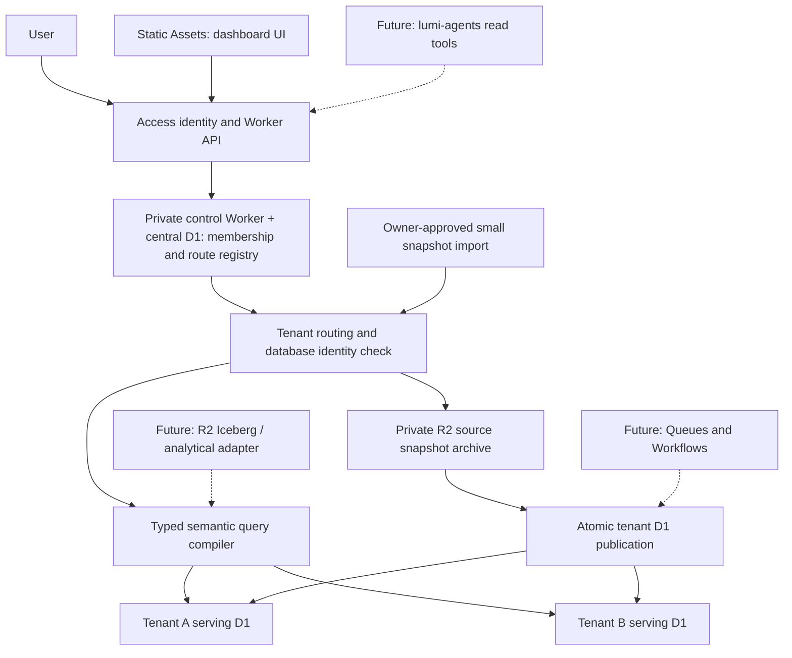

# Architecture: shared product, isolated data, reusable meaning

Status: selected bootstrap architecture, 2026-09-20. Implemented surfaces are
listed in [README](../README.md); the diagram includes clearly marked future stages.

## Decision

Build one BI product repository. Reuse its code for every deployment. Tenant
variation belongs in source mappings, metric models and dashboard definitions.

The shared implementation lives in versioned packages (`packages/core`,
`packages/cloudflare`, `packages/ui`). A customer application is a separate,
generated repository consuming exact released core artifacts; it customizes
navigation, pages, metrics, adapters and AI profiles through public interfaces and
never patches core internals. An enterprise deployment may be dedicated without a
software fork of the platform (see [ADR 0010](adr/0010-customer-application-repositories.md)).

The first useful workload is RunLumi's own operational-cost evidence, not a
universal lakehouse. Prove that two organizations can use the same dashboard
pack over separately authorized data and obtain traceable, correct numbers.

## Four boundaries

**Control plane.** A central metadata-only Worker/D1 resolves identities,
memberships, entitlements and tenant routing. Cells use a private CONTROL service
binding. Control independently validates JWTs and reads primary authority on every
request; no authorization lease or KV cache is used. It has private PACKS R2 but
no commerce D1 bindings. Current metadata release pointers live centrally, not yet
in C20's target tenant-local deployment metadata.

**Tenant data plane.** Each tenant gets its own serving D1. A registry maps an
authorized tenant ID to an allowlisted binding. The database also stores its own
tenant identity and route epoch so incorrect/stale deployment routing fails closed. Tables retain
tenant keys and foreign keys as defense in depth.

**Semantic plane.** Reviewed server definitions compile a bounded request to
prepared SQL. The current `operations-v1` registry has no author-defined joins, custom SQL or
customer expressions. A future versioned model compiler must validate grains and
joins before it grows. UI, AI and agent clients consume this same contract.

**Presentation plane.** JSON dashboard definitions refer to metric IDs; renderers
consume typed results and provenance. Dashboard duplication/editing does not
create a new app build. Tenant overlays cannot import privileged server code.

## Isolation tradeoffs

Database-per-tenant reduces accidental data mixing, simplifies customer restore,
and prevents one tenant's facts from living in another tenant's tables. It does
not protect against compromise of a Worker holding all cell bindings. A cell is
the maximum intended application-resource blast radius, not a cryptographic wall.

Start with a very small cell and migrate based on observed contention/risk. The
config tool caps bootstrap cells at 50 tenants; this is a product guard, not a
Cloudflare limit. More tenants can use more cells of the same release. A dedicated
customer gets a one-tenant cell and, when necessary, a separate Cloudflare account
and deployment credentials. Choose based on requirements, not customer prestige.

There is no account-wide database query token in request handling. Binding inventory
and database provisioning are trusted deployment operations.

## Data publication

Small snapshot import validates source registration, exact contract, row grain,
limits and idempotency. It writes a deterministic tenant-prefixed R2 object, then
batches snapshot rows, facts, active pointer and audit in a tenant D1 transaction.
A failure may leave an orphan source object. It must not publish a half dataset.
The active pointer prevents counting every historical snapshot as current data.

Each dashboard uses `query-batch`: one authorization and configuration pin, one
transactional read batch for source coverage and all widget queries. Results carry
one context hash, scope digest, route epoch, semantic release and known snapshot
vector. A changed configuration revision rejects the request. This does not assert
that independent upstream systems committed their data at the same instant.

Source health explicitly distinguishes absent snapshots, missing registered sources
and a watermark behind the requested period. Completeness is never certified by
successful transport. Detailed target contracts remain in C06/C08/C10.

## Boundary with lumi-agents

BI owns definitions, facts, evidence and read-oriented analytical requests.
Lumi Agents owns action authority, approvals, external execution and verification.

Proposed integration: an agent requests a versioned metric plan with explicit
principal/tenant/role, receives a result envelope with snapshot IDs, and proposes
an operational response. It does not receive BI management credentials or
unrestricted SQL. A finding is not permission to act. Do not share mutable
application internals across the two repositories; version the boundary contract.

## Exit paths, not premature portability

The semantic API and dashboard model should survive a change of storage engine.
Do not pretend SQL dialects are interchangeable. Build an analytical adapter only
when a measured workload needs it, with conformance fixtures for nulls, decimal
values, timestamps, aggregates and authorization. Configuration and data export
must remain possible. Portability at contracts is valuable; an abstraction over
every cloud API before customer one is not.

See [Cloudflare selection](cloudflare.md), [semantics](semantic-contract.md),
[security](../SECURITY.md) and [ADR index](adr/README.md).
